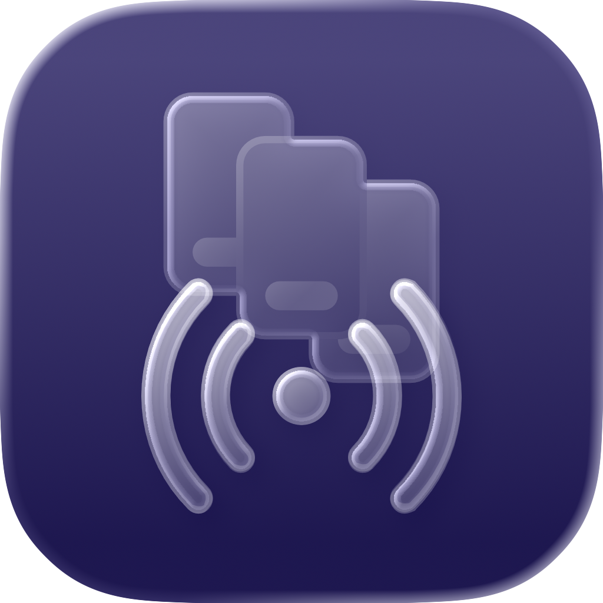
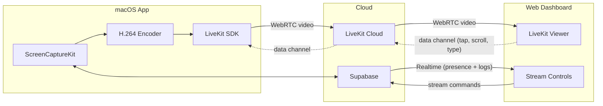

<p align="center">
  
</p>

<h3 align="center">Stream iOS Simulator to the browser over WebRTC.</h3>

<p align="center">
  <a href="https://opensource.org/licenses/MIT"></a>
  
  
  
  <a href="https://simcast.dev"></a>
</p>

<p align="center">
  <a href="https://vercel.com/new/clone?repository-url=https%3A%2F%2Fgithub.com%2Fsimcast-dev%2Fsimcast&root-directory=apps%2Fweb&env=NEXT_PUBLIC_SUPABASE_URL,NEXT_PUBLIC_SUPABASE_ANON_KEY&envDescription=Supabase%20project%20credentials%20(Project%20Settings%20%E2%86%92%20API)&envLink=https%3A%2F%2Fsupabase.com%2Fdashboard&project-name=simcast&repository-name=simcast"></a>
</p>

<!-- <p align="center">
  
</p> -->

---

SimCast captures individual iOS Simulator windows using ScreenCaptureKit, hardware-encodes to H.264 at 60 fps, and streams them to any browser via [LiveKit](https://livekit.io) (WebRTC). A web dashboard lets you start and stop streams, interact with the simulator remotely --- tap, scroll, type, press hardware buttons --- view real-time logs, capture screenshots, and share guest links. No Xcode required on the viewer side.

## Features

**Streaming**
- **Window-level capture** --- targets individual Simulator windows, not the whole screen
- **Hardware H.264** --- VideoToolbox encoding at 8 Mbps, 60 fps
- **WebRTC delivery** --- sub-second latency via LiveKit; works behind NATs without port forwarding
- **Multi-simulator** --- stream multiple simulators simultaneously, each in its own room

**Remote Interaction**
- **Tap** --- by screen coordinates or accessibility label; long-press supported
- **Scroll and gestures** --- directional scroll, edge swipes for navigation gestures
- **Text input** --- type into any focused field on the simulator
- **Hardware buttons** --- Home, Lock, Side Button, Siri, Apple Pay
- **Screenshots** --- capture on demand, auto-download to browser

**Dashboard**
- **Live viewer** --- split-pane layout with a stream grid and full-size viewer
- **Real-time logs** --- per-simulator log stream with category filters (stream, livekit, presence, command, error)
- **Screenshot and recording gallery** --- browse, preview, and download past captures
- **Guest share links** --- unauthenticated `/watch` URLs for stakeholders, QA, and demos
- **Stream stats** --- resolution, FPS, bitrate, packet loss, and jitter displayed in real time

**Built for Automation**
- **Data channel API** --- send tap, gesture, text, and button commands over LiveKit's data channel
- **AI agent ready** --- connect a LiveKit agent to observe the screen and inject actions programmatically

## Architecture



Three communication paths connect the system:

1. **Media** (LiveKit / WebRTC) --- H.264 video flows from macOS to the browser. Input commands travel the reverse direction over LiveKit's data channel.
2. **Signaling** (Supabase Realtime) --- Presence updates (which simulators are online and streaming), stream commands (start/stop), and per-simulator log broadcasts.
3. **Storage** (Supabase Storage) --- Screenshots and recordings uploaded by the macOS app, browsable in the web gallery.

## Prerequisites

You need a Mac to run the capture app. The web dashboard can run on the same machine or be deployed to a cloud host.

| Requirement | Install |
|------------|---------|
| macOS 15.6+ with Xcode 16+ | App Store or `xcode-select --install` |
| At least one booted iOS Simulator | `open -a Simulator` |
| Node.js 18+ | `brew install node` |
| Supabase CLI | `brew install supabase/tap/supabase` |
| [axe](https://github.com/cameroncooke/AXe) CLI (for interactive controls) | `brew install cameroncooke/tap/axe` |
| [Supabase](https://supabase.com) project | Free tier works --- [create one](https://supabase.com/dashboard) |
| [LiveKit Cloud](https://cloud.livekit.io) account | Free tier works --- [sign up](https://cloud.livekit.io) |

## Quick Start (Automated)

The setup script walks you through everything interactively:

```bash
git clone https://github.com/simcast-dev/simcast.git
cd simcast
./setup.sh
```

It will:
1. Check that prerequisites are installed
2. Log you into Supabase (opens browser if needed)
3. Create a new Supabase project or connect to an existing one
4. Auto-extract your project URL and API keys
5. Ask for your LiveKit credentials
6. Run database migrations (creates tables, RLS policies, storage buckets)
7. Deploy the Supabase edge functions (LiveKit token issuers)
8. Set LiveKit secrets on your Supabase project
9. Generate config files for the macOS app and web dashboard
10. Install web dependencies

After setup, follow the printed instructions to boot a simulator, run the macOS app, and open the web dashboard.

## Manual Setup

If you prefer to set things up step by step:

### 1. Clone

```bash
git clone https://github.com/simcast-dev/simcast.git
cd simcast
```

### 2. Create a Supabase project

Go to [supabase.com/dashboard](https://supabase.com/dashboard) and create a new project. Note down:
- **Project Ref** --- the subdomain in your project URL (e.g. `abcdefghijkl`)
- **Project URL** --- `https://<project-ref>.supabase.co`
- **Anon Key** --- found in Project Settings → API

### 3. Create a LiveKit Cloud project

Go to [cloud.livekit.io](https://cloud.livekit.io) and create a new project. Note down:
- **LiveKit URL** --- `wss://your-app.livekit.cloud`
- **API Key** and **API Secret** --- found in Project Settings → Keys

### 4. Run database migrations

```bash
cd apps/supabase
supabase link --project-ref <your-project-ref>
supabase db push
```

This creates:
- `stream_commands` table (web → macOS signaling)
- `screenshots` and `recordings` tables with row-level security
- `screenshots` and `recordings` storage buckets with per-user RLS policies
- Realtime publication for all tables

### 5. Deploy edge functions

```bash
supabase functions deploy livekit-token
supabase functions deploy livekit-guest-token
```

These issue LiveKit JWTs --- `livekit-token` for authenticated users, `livekit-guest-token` for guest share links.

### 6. Set LiveKit secrets

```bash
supabase secrets set \
  LIVEKIT_URL=wss://your-app.livekit.cloud \
  LIVEKIT_API_KEY=your-api-key \
  LIVEKIT_API_SECRET=your-api-secret
```

### 7. Configure the macOS app

Copy the example config and fill in your Supabase credentials:

```bash
cp apps/macos/simcast/Config/Debug.xcconfig.example \
   apps/macos/simcast/Config/Debug.xcconfig
```

Edit `Debug.xcconfig`:

```
SUPABASE_URL = https://<your-project-ref>.supabase.co
SUPABASE_ANON_KEY = <your-anon-key>
```

### 8. Build and run the macOS app

```bash
open apps/macos/simcast.xcodeproj
```

Press **Cmd+R** to build and run. When prompted:
- Grant **Screen Recording** permission (System Settings → Privacy & Security → Screen Recording)
- Grant **Accessibility** permission (System Settings → Privacy & Security → Accessibility)

> After granting permissions, you may need to restart the app for them to take effect.

### 9. Configure the web dashboard

```bash
cp apps/web/.env.local.example apps/web/.env.local
```

Edit `.env.local` with your Supabase credentials:

```
NEXT_PUBLIC_SUPABASE_URL=https://<your-project-ref>.supabase.co
NEXT_PUBLIC_SUPABASE_ANON_KEY=<your-anon-key>
```

### 10. Run the web dashboard

```bash
cd apps/web
npm install
npm run dev
```

### 11. Verify everything works

1. Open [http://localhost:3000](http://localhost:3000)
2. Create an account (email + password) --- this is shared between macOS and web
3. Sign in on both the web dashboard and the macOS app with the same account
4. Boot a simulator (`open -a Simulator`) --- it should appear in the dashboard's stream grid
5. Click **Start Stream** on a simulator card
6. The live stream should appear in the viewer pane
7. Try tapping on the stream, typing text, or pressing hardware buttons

## Deployment

The macOS capture app always runs locally --- it needs access to Xcode simulators. The web dashboard can be deployed anywhere.

### Option A: Vercel (Cloud Hosting)

The simplest way to host the web dashboard publicly.

**One-click deploy:**

[](https://vercel.com/new/clone?repository-url=https%3A%2F%2Fgithub.com%2Fsimcast-dev%2Fsimcast&root-directory=apps%2Fweb&env=NEXT_PUBLIC_SUPABASE_URL,NEXT_PUBLIC_SUPABASE_ANON_KEY&envDescription=Supabase%20project%20credentials%20(Project%20Settings%20%E2%86%92%20API)&envLink=https%3A%2F%2Fsupabase.com%2Fdashboard&project-name=simcast&repository-name=simcast)

**Manual Vercel setup:**

1. Import your fork/repo at [vercel.com/new](https://vercel.com/new)
2. Set **Root Directory** to `apps/web`
3. Framework preset will auto-detect as **Next.js**
4. Add environment variables:
   - `NEXT_PUBLIC_SUPABASE_URL`
   - `NEXT_PUBLIC_SUPABASE_ANON_KEY`
5. Click **Deploy**

After deploying, add your Vercel domain to Supabase's allowed redirect URLs:
- Go to Supabase Dashboard → Authentication → URL Configuration
- Add `https://your-app.vercel.app` to **Redirect URLs**

> The macOS app still runs locally on your Mac. Vercel only hosts the web dashboard --- viewers can access it from anywhere, but streaming requires the macOS app to be running.

### Option B: Self-Hosting with Tailscale

Run the web dashboard on the same Mac as the capture app and access it from any device on your private Tailscale network.

**Setup:**

1. Install Tailscale:
   ```bash
   brew install tailscale
   ```

2. Sign in and connect to your tailnet:
   ```bash
   # Open Tailscale from the menu bar and sign in, or:
   open -a Tailscale
   ```

3. Build and start the web dashboard in production mode:
   ```bash
   cd apps/web
   npm run build
   npm start
   ```

4. Access from any device on your tailnet:
   ```
   http://<your-mac-tailscale-ip>:3000
   ```
   Find your Tailscale IP in the Tailscale menu bar app, or run `tailscale ip -4`.

**Benefits:** No cloud hosting, no public exposure, zero cost, works on your private network --- great for team development and internal testing.

#### Tailscale Funnel (Public Access)

[Tailscale Funnel](https://tailscale.com/kb/1223/funnel) exposes a local port to the public internet with automatic HTTPS --- no Vercel needed.

1. Enable Funnel in your [Tailscale admin console](https://login.tailscale.com/admin/dns) (under DNS → Funnel)

2. Serve the dashboard via Funnel:
   ```bash
   tailscale funnel 3000
   ```

3. You'll get a public URL like `https://your-mac.tail12345.ts.net/`

4. Add this URL to Supabase's allowed redirect URLs:
   - Supabase Dashboard → Authentication → URL Configuration
   - Add `https://your-mac.tail12345.ts.net` to **Redirect URLs**

**Benefits:** Public HTTPS URL without Vercel or any cloud provider. Ideal for sharing with stakeholders, QA, or demos. The URL is persistent as long as Funnel is running.

> **Note:** The macOS capture app must be running on the same machine (or reachable on the tailnet) for streams to work.

## Repository Structure

```
simcast/
├── apps/
│   ├── macos/          # Swift/SwiftUI — captures Simulator, streams via LiveKit
│   ├── web/            # Next.js 16 — dashboard, stream viewer, interactive controls
│   └── supabase/       # Database migrations, edge functions, config
├── docs/               # Design documents and assets
├── setup.sh            # Interactive setup script
├── CLAUDE.md           # AI assistant project context
└── README.md
```

## Tech Stack

| Component | Technology |
|-----------|-----------|
| macOS App | Swift 6, SwiftUI, ScreenCaptureKit, VideoToolbox |
| Web Dashboard | Next.js 16, TypeScript, React 19, Tailwind CSS v4 |
| Streaming | LiveKit (WebRTC), H.264, 8 Mbps / 60 fps |
| Backend | Supabase (Auth, Realtime, Storage, Edge Functions) |
| Input Injection | [axe](https://github.com/cameroncooke/AXe) CLI |

## Troubleshooting

<details>
<summary><b>Black frames or no video</b></summary>

The macOS app needs **Screen Recording** permission. Go to System Settings → Privacy & Security → Screen Recording and make sure SimCast is enabled. Restart the app after granting.
</details>

<details>
<summary><b>Tap, scroll, or text input not working</b></summary>

1. Grant **Accessibility** permission: System Settings → Privacy & Security → Accessibility → enable SimCast
2. Verify `axe` CLI is installed: `/opt/homebrew/bin/axe --version`
3. Restart the app after granting permissions
</details>

<details>
<summary><b>No simulators appear in the dashboard</b></summary>

Make sure at least one simulator is booted:
```bash
xcrun simctl list devices booted
```
If empty, boot one: `open -a Simulator` or `xcrun simctl boot "iPhone 16"`.
</details>

<details>
<summary><b>Stream doesn't start</b></summary>

1. Check that LiveKit secrets are set: `cd apps/supabase && supabase secrets list`
2. Check edge function logs: `supabase functions logs livekit-token --scroll`
3. Verify both apps are signed in with the same account
</details>

<details>
<summary><b>CSP or CORS errors in the browser console</b></summary>

Ensure `NEXT_PUBLIC_SUPABASE_URL` in `.env.local` matches your Supabase project URL exactly. The CSP headers are derived from this environment variable.
</details>

<details>
<summary><b>Edge function deployment fails</b></summary>

Make sure you're linked to the correct project:
```bash
cd apps/supabase
supabase link --project-ref <your-project-ref>
supabase functions deploy livekit-token
```
Check logs with: `supabase functions logs livekit-token --scroll`
</details>

## Contributing

SimCast is in early active development. Issues, feature requests, and pull requests are welcome.

If you find a bug or have an idea, [open an issue](https://github.com/simcast-dev/simcast/issues). For code contributions, fork the repo, create a branch, and submit a PR.

## License

MIT --- see [LICENSE](LICENSE) for details.
